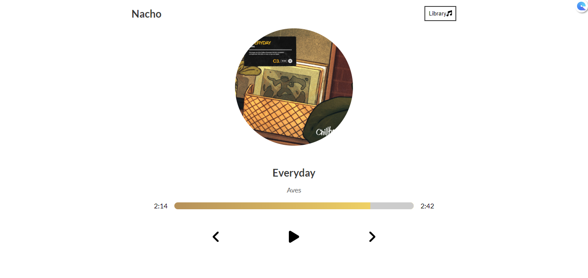

# Nacho - React music player

This is a music player built on the [React.JS](https://reactjs.org/) library.

## Table of contents

- [Overview](#overview)
  - [Screenshot](#screenshot)
  - [Links](#links)
- [My process](#my-process)
  - [Built with](#built-with)
  - [What I learned](#what-i-learned)
  - [Continued development](#continued-development)
  - [Useful resources](#useful-resources)
- [Author](#author)

## Overview

### Screenshot

### Links

- Solution URL: [https://github.com/DevanshSK/react-music-player](https://github.com/DevanshSK/react-music-player)
- Live Site URL: [https://devanshsk.github.io/react-music-player/](https://devanshsk.github.io/react-music-player/)

## My process

### Built with

- Semantic HTML5 markup
- CSS custom properties
- Flexbox
- CSS Grid
- Mobile-first workflow
- [React](https://reactjs.org/) - JS library

### What I learned

In this project I learned a lot of things in React.
Some of them are as follows:

1. How to create and deploy a react app from scratch.
2. Learned the Implementation of useState, useEffect and useRef hooks.
3. Learned about bug fixing process in applications, as there were a lot of bugs encountered during development.

### Continued development

In the future, I would like to add a backend and a database to the application such that we can add more songs to the music player easily.

### Useful resources

- [Official ReactJS documentation](https://reactjs.org/) - This documentation helped a lot of the time.
- [ReactJS handbook](https://thevalleyofcode.com/react/) - This is a handbok by The valley of code.

## Author

- Twitter - [@devansh_sk](https://twitter.com/devansh_sk)
